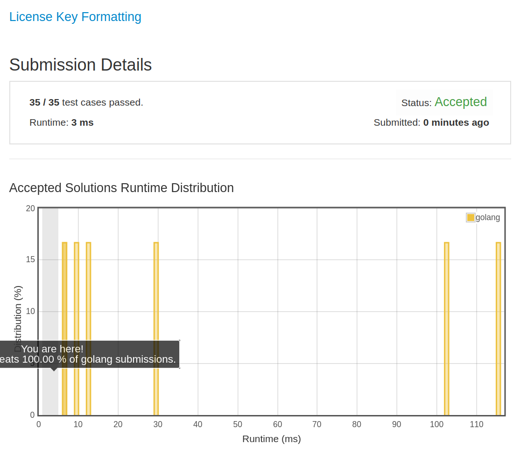

# [482. License Key Formatting](https://leetcode.com/problems/license-key-formatting/)

## 题目

Now you are given a string S, which represents a software license key which we would like to format. The string S is composed of alphanumerical characters and dashes. The dashes split the alphanumerical characters within the string into groups. (i.e. if there are M dashes, the string is split into M+1 groups). The dashes in the given string are possibly misplaced.

We want each group of characters to be of length K (except for possibly the first group, which could be shorter, but still must contain at least one character). To satisfy this requirement, we will reinsert dashes. Additionally, all the lower case letters in the string must be converted to upper case.

So, you are given a non-empty string S, representing a license key to format, and an integer K. And you need to return the license key formatted according to the description above.

Example 1:

```text
Input: S = "2-4A0r7-4k", K = 4

Output: "24A0-R74K"

Explanation: The string S has been split into two parts, each part has 4 characters.
```

Example 2:

```text
Input: S = "2-4A0r7-4k", K = 3

Output: "24-A0R-74K"

Explanation: The string S has been split into three parts, each part has 3 characters except the first part as it could be shorter as said above.
```

Note:

1. The length of string S will not exceed 12,000, and K is a positive integer.
1. String S consists only of alphanumerical characters (a-z and/or A-Z and/or 0-9) and dashes(-).
1. String S is non-empty.

## 解题思路

见程序注释

