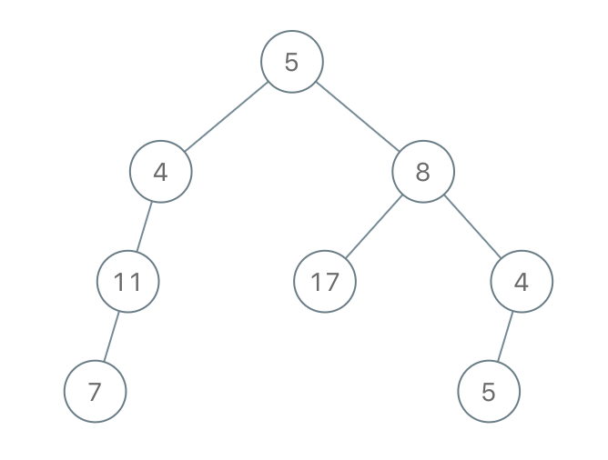

# [1080. Insufficient Nodes in Root to Leaf Paths](https://leetcode.com/problems/insufficient-nodes-in-root-to-leaf-paths/)

Given the root of a binary tree, consider all root to leaf paths: paths from the root to any leaf.  (A leaf is a node with no children.)

A node is insufficient if every such root to leaf path intersecting this node has sum strictly less than limit.

Delete all insufficient nodes simultaneously, and return the root of the resulting binary tree.

Example 1:


```text
Input: root = [1,2,3,4,-99,-99,7,8,9,-99,-99,12,13,-99,14], limit = 1
Output: [1,2,3,4,null,null,7,8,9,null,14]
```

Example 2:




```text
Input: root = [5,4,8,11,null,17,4,7,1,null,null,5,3], limit = 22
Output: [5,4,8,11,null,17,4,7,null,null,null,5]
```

Example 3:


```text
Input: root = [1,2,-3,-5,null,4,null], limit = -1
Output: [1,null,-3,4]
```

Note:

1. `The given tree will have between 1 and 5000 nodes.`
1. `-10^5 <= node.val <= 10^5`
1. `-10^9 <= limit <= 10^9`
